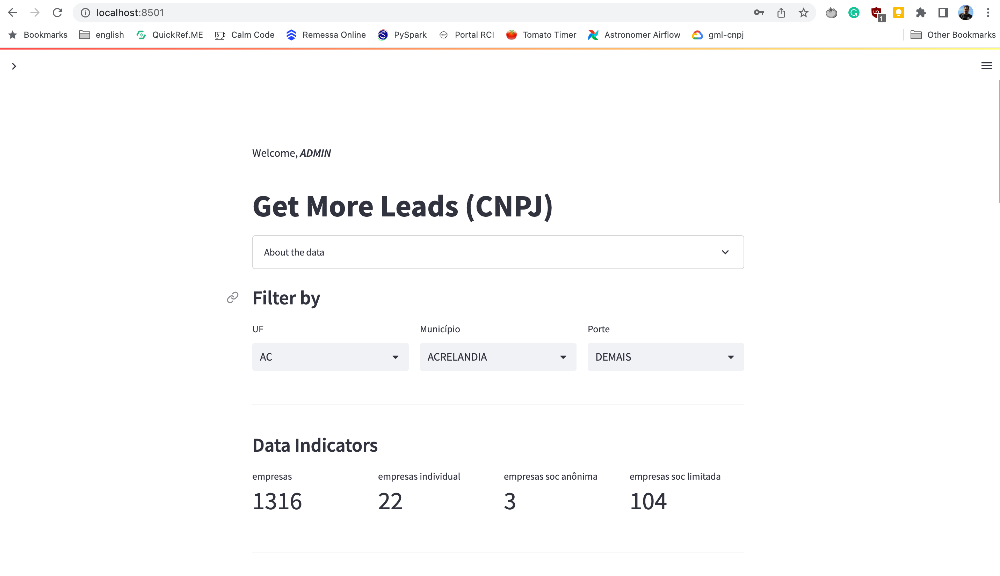

# GML BI Community Edition

Esta é uma ferramenta de análise de dados que pode ajudá-lo a obter mais leads, aumentar
suas vendas e receita.

É possível integrar os dados com nossas outras ferramentas, para melhorar o
relacionamento com o cliente (CRM), ou melhorar a sua reputação ou ainda obter feedback.

Esta ferramenta é de uso gratuito.

## Como funciona?

Primeiramente, você precisa [baixar](https://www.getmoreleads.com.br/download/) o
banco de dados.

Este banco de dados contém 6M de empresas e o tamanho é de aproximadamente 500MB.

Esses dados foram limpos e enriquecidos e estão disponíveis para serem usados através
de um **Dashboard** ou **EDA**. Ambos são ferramentas analíticas, conhecidas como Web
Analysis Tool (WAT), onde você pode executar no seu próprio computador sem a necessidade
de adquirir licenças.

- **Dashboard**: ferramenta web de análise (primária), para obter informações rápidas e
  gerar leads.
- **EDA**: ferramenta web de análise (secundária), possui diversos recursos para fazer
  análise exploratória de dados.

O **Dashboard**, é uma ferramenta muito simples e fácil de usar, excelente para obter
informações rápidas e gerar leads. Basta filtrar por UF, Município e Tamanho da
Empresa. E todos os valores são atualizados automaticamente.

Além disso, você pode exportar/baixar os dados para um formato de arquivo CSV e
salvá-los em seu próprio computador.




Mas há algumas _limitações_:

- Os dados disponibilizados é uma parte do banco de dados completo.
- O banco de dados completo contém mais de 30 milhões de empresas.
- Para usar este banco de dados completo, você precisa escolher
  um [Plano](https://www.getmoreleads.com.br/plan/) e utilizar a nossa Solução Cloud.
- Ou você pode [fazer contato](mailto:service@getmoreleads.com.br), para saber mais
  sobre listas segmentadas que estejam mais adequado às suas necessidades.

**NOTAS**:

- Esta versão do aplicativo não foi criada ou testada para rodar no Windows, apenas em
  Linux e Mac.
- Para rodar no Windows recomendamos o uso do Docker.

## Como instalar?

Você precisa ter o `git` instalado na sua máquina.

Digite o comando abaixo para clonar o repositório do GitHub:

````shell
$ git@github.com:lserra/gml_bi_ce.git
````

## Como usar?

1-Após clonar o repositório e baixar o banco de dados, você precisa mover este banco de
dados para o seguinte caminho: `../gml_bi_ce/data/output`

2-Usando a janela do terminal, execute os comandos abaixo, para criar um _docker image_:

```shell
$ cd gml_bi_ce
$ bash build_local_image.sh
>>> Initializing Docker-App image for gml_cnpj/bi_ce . . .
[+] Building 156.3s (13/13) FINISHED                                                                                                                                              
 => [internal] load build definition from dockerfile-bi                                                                                                                      0.1s
 => => transferring dockerfile: 671B                                                                                                                                         0.0s
 => [internal] load .dockerignore                                                                                                                                            0.1s
 => => transferring context: 264B                                                                                                                                            0.0s
 => [internal] load metadata for docker.io/library/python:3.9-buster                                                                                                         3.8s
 => [auth] library/python:pull token for registry-1.docker.io                                                                                                                0.0s
 => [1/7] FROM docker.io/library/python:3.9-buster@sha256:f350d5f7d979b56ea473b6c8520c506d4a1b5befb9abbc53e8b9cd79da1a920b                                                   4.7s
 => => resolve docker.io/library/python:3.9-buster@sha256:f350d5f7d979b56ea473b6c8520c506d4a1b5befb9abbc53e8b9cd79da1a920b                                                   0.0s
 => => sha256:22ec6efe74fe398590a377b89564306a65219da61ff69bb9f0a0eb0d5e4e9728 18.00MB / 18.00MB                                                                             2.6s
 => => sha256:f350d5f7d979b56ea473b6c8520c506d4a1b5befb9abbc53e8b9cd79da1a920b 988B / 988B                                                                                   0.0s
 => => sha256:aa07d07889c780f24b3a07f34e555d96f1e5dcbf271b80f3a40f6f2e46f6a3ba 2.01kB / 2.01kB                                                                               0.0s
 => => sha256:1459e87f643f74ca6e5cc61c5014c315ebccb18ff187aae790dfdb5b683251d3 7.51kB / 7.51kB                                                                               0.0s
 => => sha256:0d632624a7af80e1aebbec1b8f842a1b4e5371c8abca7c1f5595414909e2f077 244B / 244B                                                                                   0.4s
 => => sha256:9d2b86380a872b28824680589b267370fb9032d49dc81550553ce0b65a28a2b7 2.85MB / 2.85MB                                                                               1.2s
 => => extracting sha256:22ec6efe74fe398590a377b89564306a65219da61ff69bb9f0a0eb0d5e4e9728                                                                                    1.5s
 => => extracting sha256:0d632624a7af80e1aebbec1b8f842a1b4e5371c8abca7c1f5595414909e2f077                                                                                    0.0s
 => => extracting sha256:9d2b86380a872b28824680589b267370fb9032d49dc81550553ce0b65a28a2b7                                                                                    0.3s
 => [internal] load build context                                                                                                                                            0.0s
 => => transferring context: 12.76kB                                                                                                                                         0.0s
 => [2/7] WORKDIR /gml_bi_ce                                                                                                                                                 0.1s
 => [3/7] COPY ../.. .                                                                                                                                                       4.3s
 => [4/7] RUN apt-get update && apt-get install -y     build-essential     curl     software-properties-common     && rm -rf /var/lib/apt/lists/*                           18.1s
 => [5/7] RUN pip install --upgrade pip                                                                                                                                      5.8s 
 => [6/7] RUN pip install --no-cache-dir --trusted-host pypi.python.org -r requirements.txt                                                                                107.6s 
 => [7/7] RUN chmod a+x *.sh && chmod a+x *.py                                                                                                                               0.4s 
 => exporting to image                                                                                                                                                      11.2s 
 => => exporting layers                                                                                                                                                     11.2s 
 => => writing image sha256:3152e6dd86cdd97d5952bff88efb2f33439e573fc2bbced381f9e9aee3ec2c38                                                                                 0.0s 
 => => naming to docker.io/gml_cnpj/bi_ce:1.0         
```

**NOTA**: certifique-se de que o Docker está instalado no seu computador e que ele está
ativo. Se você observar o retorno da mensagem de erro abaixo, provavelmente você não
possui o Docker instalado, ou ele não está ativo.

```text
ERROR: Cannot connect to the Docker daemon at unix:///var/run/docker.sock. Is the docker
daemon running?
```

3-Em seguida, execute o comando abaixo, para ativar o _docker container_:

```shell
$ bash start_local_container.sh
=========================== [ GML BI TOOLS ] =====================================
==================================================================================
[             W E L C O M E   T O   G M L   B I   T O O L S                      ]
==================================================================================

SETTINGS:
> Working dir: /gml_bi_ce
> Please, inform the BI tool: [ dash OR eda ]
dash
```

4-Neste momento é possível escolher qual ferramenta usar. Se você deseja usar a
ferramenta para obter informação rápida e gerar leads, então digite `dash`.
Se você deseja usar a ferramenta de exploração de dados, então digite `eda`.

```text
==================================================================================
[                         CHECKING APPLICATION . . .                             ]
==================================================================================

===> [OK] - '/data' directory found!
===> [OK] - '/logs' directory found!
===> [OK] - '/src' directory found!
===> [OK] - SCRIPT: put_bt_empresas_in_dw.py found
===> [OK] - SCRIPT: dw_operations.py found
===> [OK] - SCRIPT: logger_app.py found
===> [OK] - SCRIPT: wat.py found
===> [OK] - SCRIPT: config.py found
===> [OK] - SCRIPT: dashboard.py found
===> [OK] - SCRIPT: eda_tool.py found
===> [OK] - SCRIPT: login.py found
===> [OK] - SCRIPT: test_gml_bi.py found

==================================================================================
[                           TESTING APPLICATION . . .                            ]
==================================================================================

....
----------------------------------------------------------------------
Ran 4 tests in 9.899s

OK

==================================================================================
[                          STARTING APPLICATION . . .                            ]
==================================================================================


Collecting usage statistics. To deactivate, set browser.gatherUsageStats to False.


  You can now view your Streamlit app in your browser.

  URL: http://0.0.0.0:8501
```

5-Copie o endereço que aparece no seu terminal e cole no seu navegador (browser) de
internet. Também é possível acessar a aplicação usando o seguinte endereço:
`http://localhost:8501`

6-Para entrar na aplicação, use as seguintes credenciais (user/password):
`admin`/`admin`.

## Partnership or Sponsorship

Se você encontrou algum _bug_, ou se você tem uma idea ou sugestão de melhoria, por
favor [create an issue](https://github.com/lserra/gml_bi_ce/issues).

Ou, se você está interessado em contribuir com este projeto, por favor envie-nos um
[e-mail](mailto:contribute@getmoreleads.com.br).

Mas se preferir, você também pode nos pagar um café, basta clicar no link abaixo:

<a href="https://buymeacoffee.com/cYXalAb" target="_blank">

</a>

## License

Esta é uma aplicação open-source e segue as regras de licenciamento do MIT.

```text
The MIT License (MIT)

Copyright (c) 2023 Laercio Serra

Permission is hereby granted, free of charge, to any person obtaining a copy
of this software and associated documentation files (the "Software"), to deal
in the Software without restriction, including without limitation the rights
to use, copy, modify, merge, publish, distribute, sublicense, and/or sell
copies of the Software, and to permit persons to whom the Software is
furnished to do so, subject to the following conditions:

The above copyright notice and this permission notice shall be included in all
copies or substantial portions of the Software.

THE SOFTWARE IS PROVIDED "AS IS", WITHOUT WARRANTY OF ANY KIND, EXPRESS OR
IMPLIED, INCLUDING BUT NOT LIMITED TO THE WARRANTIES OF MERCHANTABILITY,
FITNESS FOR A PARTICULAR PURPOSE AND NONINFRINGEMENT. IN NO EVENT SHALL THE
AUTHORS OR COPYRIGHT HOLDERS BE LIABLE FOR ANY CLAIM, DAMAGES OR OTHER
LIABILITY, WHETHER IN AN ACTION OF CONTRACT, TORT OR OTHERWISE, ARISING FROM,
OUT OF OR IN CONNECTION WITH THE SOFTWARE OR THE USE OR OTHER DEALINGS IN THE
SOFTWARE.
```
